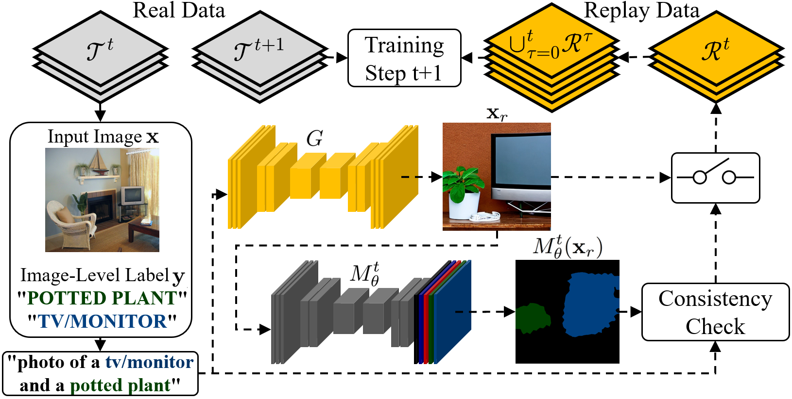

# DR.WILSS
Official repository of the paper DR.WILSS: Diffusion-based Replay for Weakly supervised
class-IncrementaL Semantic Segmentation

---

## Abstract

Weakly Supervised Class-Incremental Semantic Segmentation (WILSS) aims to train a segmentation model over multiple steps, each introducing new concepts to be learned with only image-level supervision. We introduce DR.WILSS, an innovative approach to address catastrophic forgetting in continual learning using diffusion-based generative replay. Our framework leverages language clues to guide the diffusion process, employing self-inpainting and regularization techniques to efficiently produce replay data aiding the learning process. By generating high-quality replay data, the information from previously learned classes can be preserved during continual updates, a critical challenge in incremental learning scenarios.
Experimental results demonstrate state-of-the-art performance while avoiding training data storage and additional resource-demanding tools in network training, making it a promising solution for real-world applications.

  

> [!NOTE]  
> The official code implementation will be available upon paper acceptance
