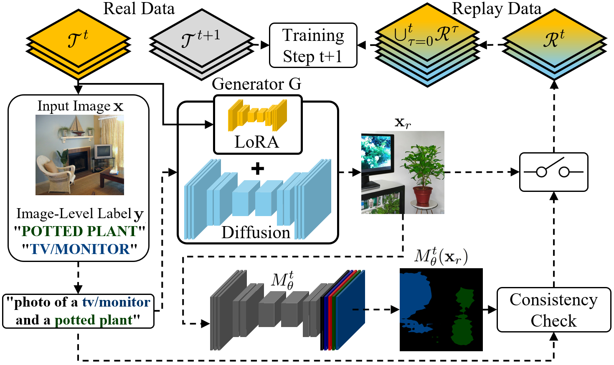

# DR.WILSS
Official repository of the paper DR.WILSS: Diffusion-Based Replay for Weakly supervised Continual Semantic Segmentation

---

## Abstract

Weakly supervised class-incremental semantic segmentation (WILSS) aims to train a segmentation model over multiple steps, each introducing new concepts to be learned with only image-level supervision.  We introduce DR.WILSS, an innovative approach to address catastrophic forgetting in continual learning using diffusion-based generative replay. Our framework leverages language clues to guide the diffusion process, employing self-inpainting and regularization techniques to efficiently produce replay data, aiding the learning process. By generating high-quality replay data, the information from previously learned classes can be preserved during continual updates, a critical challenge in incremental learning scenarios. To further align the statistics of replay data with those of training samples, we apply LoRAs to the generative model. Experimental results demonstrate state-of-the-art performance across multiple benchmarks and generative architectures, while avoiding storage of training data and the use of additional resource-demanding tools during training. The proposed technique enables an optimal tradeoff between training complexity and inference-time accuracy, making DR.WILSS a promising solution for real-world applications.

  

> [!NOTE]  
> The official code implementation will be available upon paper acceptance
